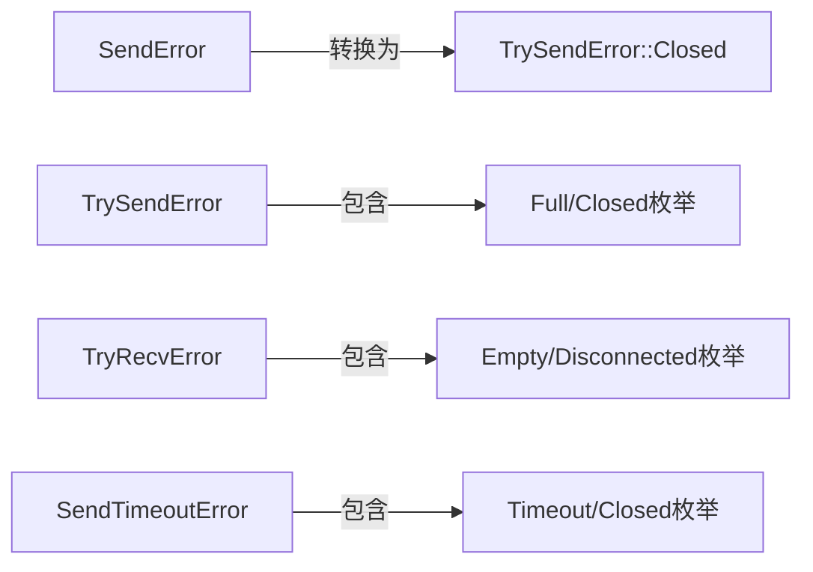

### 文件说明：通道错误类型定义

#### 文件目的
该文件定义了Tokio多生产者单消费者（MPSC）通道在发送/接收操作中可能出现的错误类型，为通道操作提供清晰的错误反馈机制。

---

#### 核心组件

1. **SendError<T>**
   - **用途**：发送操作失败时返回的错误（如通道关闭）
   - **实现**：
     - `Debug` 显示非详尽结构体
     - `Display` 显示"channel closed"
     - 实现标准`Error` trait
   - **使用场景**：`Sender::send`方法在通道关闭时返回此错误

2. **TrySendError<T>**
   - **枚举类型**：
     - `Full(T)`：通道已满无法立即发送
     - `Closed(T)`：接收端已关闭
   - **特性**：
     - `into_inner()`方法可提取原始数据
     - `Debug`显示枚举类型
     - `Display`显示"no available capacity"或"channel closed"
   - **转换支持**：可从`SendError`转换而来

3. **TryRecvError**
   - **枚举类型**：
     - `Empty`：通道为空但发送端未关闭
     - `Disconnected`：发送端已全部关闭
   - **实现**：
     - 直接派生`Debug`
     - `Display`显示具体错误信息

4. **RecvError（已弃用）**
   - 替代方案：现在通过`Option`类型返回结果
   - 保留原因：兼容旧代码

5. **SendTimeoutError<T>（需启用时间配置）**
   - **枚举类型**：
     - `Timeout(T)`：发送超时
     - `Closed(T)`：通道关闭
   - 提供与`TrySendError`类似的接口和行为

---

#### 错误类型交互关系

---

#### 在项目中的角色
此文件为Tokio MPSC通道提供了完整的错误类型定义，通过不同错误类型精准描述通道操作失败的原因（如通道关闭、容量不足、超时等），帮助开发者实现健壮的错误处理逻辑，是通道模块错误处理的核心基础组件。
